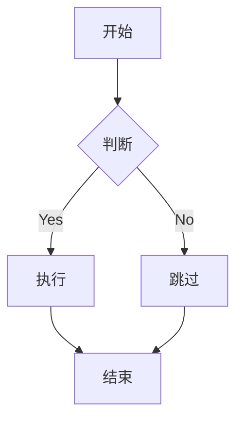

# Markdown 进阶语法教程

## 任务列表

使用 `- [ ]` 和 `- [x]` 创建任务列表：

```markdown
- [x] 完成基础语法学习
- [ ] 学习进阶语法
- [ ] 练习 Markdown 写作
```

效果展示：
- [x] 完成基础语法学习
- [ ] 学习进阶语法
- [ ] 练习 Markdown 写作

## 表格对齐

使用 `:` 控制表格对齐方式：

```markdown
| 左对齐 | 居中对齐 | 右对齐 |
|:------|:--------:|-------:|
| 内容 | 内容 | 内容 |
```

效果展示：
| 左对齐 | 居中对齐 | 右对齐 |
|:------|:--------:|-------:|
| 内容 | 内容 | 内容 |

## 脚注

在文本中添加脚注引用：

```markdown
这是一段带有脚注的文本[^1]。

[^1]: 这是脚注的内容。
```

## 数学公式

使用 LaTeX 语法编写数学公式：

```markdown
行内公式：$E = mc^2$

独立公式：
$$
\sum_{i=1}^n a_i = 0
$$
```

## 流程图

使用 Mermaid 语法绘制流程图：



## 代码高亮和行号

```javascript{1,3-5}
// 第1行高亮
let x = 1;
// 第3-5行高亮
function hello() {
    console.log('Hello');
}
```

## 高级引用

支持在引用中使用其他 Markdown 元素：

> ### 引用中的标题
> 
> - 引用中的列表项
> - 包含**粗体**和*斜体*
>
> ```javascript
> // 引用中的代码块
> console.log('Hello');
> ```

## 自定义容器

::: tip 提示
这是一个提示信息
:::

::: warning 警告
这是一个警告信息
:::

::: danger 危险
这是一个危险信息
:::

## HTML 内联支持

支持直接使用 HTML 标签：

<details>
<summary>点击展开</summary>

这是展开后显示的内容。

</details>

## 键盘按键

使用 `<kbd>` 标签显示键盘按键：

按下 <kbd>Ctrl</kbd> + <kbd>C</kbd> 复制文本

## 实战技巧

1. **文档目录生成**
   ```markdown
   [[toc]]
   ```

2. **图片尺寸控制**
   ```markdown
   
   ```

3. **转义字符**
   ```markdown
   \* 这不是斜体 \*
   ```

## 扩展语法示例

创建一个综合性文档：

```markdown
# 项目文档

[[toc]]

## 安装步骤 ✨

1. [ ] 下载项目
2. [x] 安装依赖
   ```bash
   npm install
   ```

> [!NOTE]
> 请确保已安装 Node.js

详细信息请参考[文档](docs.example.com)[^2]

[^2]: 官方文档链接
```

---

掌握这些进阶语法，将让您的 Markdown 文档更加专业和生动！