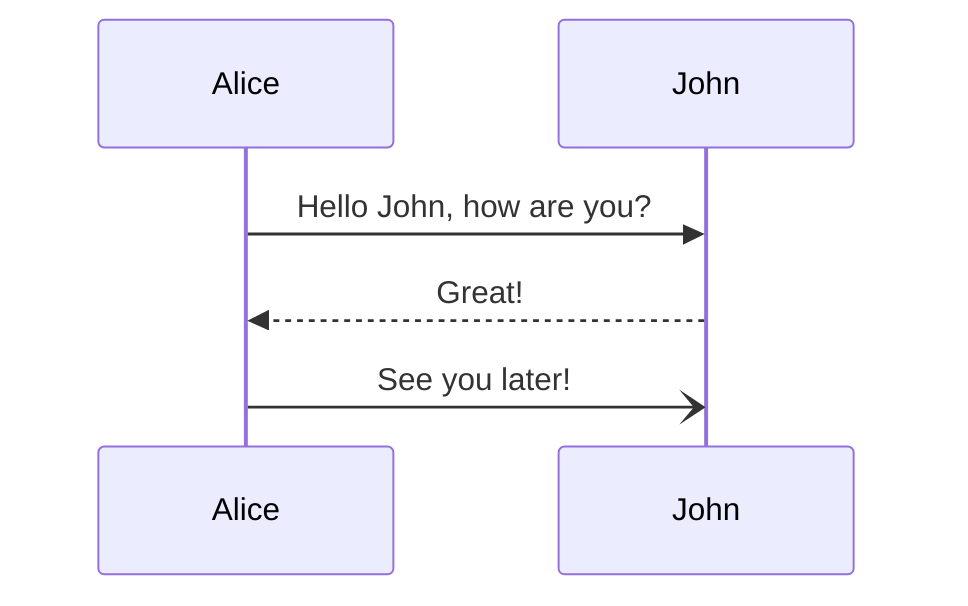

# Markdown 高级语法与实战教程

## 自定义容器扩展

### 信息容器

```markdown
::: info 信息
这是一条信息提示
:::

::: tip 技巧
这是一个技巧说明
:::

::: warning 注意
这是一个警告提示
:::

::: danger 危险
这是一个危险警告
:::
```

### 自定义标题容器

```markdown
::: details 点击查看详情
这里是折叠的内容
:::
```

## 代码块增强

### 代码块行号与高亮

```js{2,4-6}
function example() {
  // 这一行会高亮
  let x = 1;
  // 这些行也会高亮
  let y = 2;
  return x + y;
}
```

### 代码组

~~~markdown
:::: code-group
::: code-group-item yarn
```bash
yarn add vuepress-theme-hope
```
:::

::: code-group-item npm
```bash
npm i vuepress-theme-hope
```
:::
::::
~~~

## 图表支持

### Mermaid 流程图



### 数学公式进阶

```latex
$$
\begin{array}{c}
\nabla \times \vec{\mathbf{B}} -\, \frac1c\, \frac{\partial\vec{\mathbf{E}}}{\partial t} &
= \frac{4\pi}{c}\vec{\mathbf{j}}    \nabla \cdot \vec{\mathbf{E}} & = 4 \pi \rho \\
\nabla \times \vec{\mathbf{E}}\, +\, \frac1c\, \frac{\partial\vec{\mathbf{B}}}{\partial t} & = \vec{\mathbf{0}} \\
\nabla \cdot \vec{\mathbf{B}} & = 0
\end{array}
$$
```

## 实战技巧

### 1. 项目文档模板

```markdown
# 项目名称


## 项目描述

> 简要描述项目的主要功能和目的

## 功能特性

- [ ] 特性1
- [x] 特性2
- [ ] 特性3

## 安装说明

::: code-group
```bash [npm]
npm install your-package
```

```bash [yarn]
yarn add your-package
```
:::

## 使用示例

\`\`\`javascript
import { example } from 'your-package';

example.init({
  // 配置项
});
\`\`\`
```

### 2. 技术博客模板

```markdown
---
title: 文章标题
date: 2024-02-08
categories:
  - 技术
tags:
  - Web
  - JavaScript
---

# 标题

[[toc]]

## 背景介绍

::: tip 核心要点
- 要点1
- 要点2
:::

## 技术实现

### 步骤1

\`\`\`javascript
// 示例代码
\`\`\`

### 步骤2

> 关键说明...

## 最佳实践

1. 实践1
2. 实践2

## 常见问题

::: details 问题1
解答...
:::

## 参考资料

- [参考1](链接1)
- [参考2](链接2)
```

## 高级应用技巧

1. **文档版本控制**
   - 使用 git 标签记录版本
   - 在文档中添加版本徽章

2. **自动化工具集成**
   - 使用 husky 进行提交前检查
   - 使用 markdownlint 保持格式统一

3. **协作最佳实践**
   - 使用统一的模板
   - 保持文档结构一致
   - 定期更新和维护

## 扩展插件推荐

- markdownlint：格式检查
- markdown-it：Markdown 解析器
- mermaid：图表绘制
- katex：数学公式排版

---

通过本教程的学习，你已经掌握了 Markdown 的高级特性和实战技巧。现在就开始创建专业的技术文档吧！